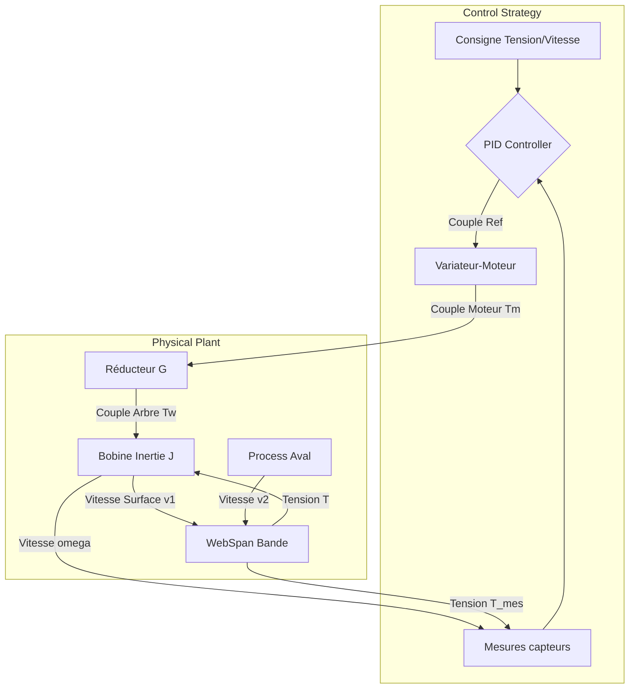

# Documentation Technique : Architecture du Jumeau Numérique (Digital Twin)

## 1. Philosophie de Modélisation (Block-Based Physics)
L'architecture de simulation de **ProWinder Dynamics** a été refondue pour suivre les standards industriels (similaires à MATLAB Simscape / PowerSys). 
Plutôt que d'utiliser une seule équation monolithique, le système est décomposé en **blocs physiques interconnectés** qui échangent des flux d'énergie (Couple, Vitesse) et de matière (Vitesse de bande, Tension).

Cette approche modulaire permet de :
1.  Capturer les phénomènes émergents (résonances, retards de transport).
2.  Tester des composants interchangeables (ex: changer un moteur Siemens par un Rockwell).
3.  Valider la stratégie de contrôle dans un environnement "Physiquement Correct".

---

## 2. Architecture des Composants (`src/prowinder/mechanics/`)

Le système est composé de trois blocs fondamentaux interagissant à chaque pas de temps ($dt$).

### A. Le Bloc `Winder` (L'Enrouleur/Dérouleur)
Représente la partie mécanique rotative à géométrie variable.
*   **Responsabilité** : Intégrer l'équation fondamentale de la dynamique.
*   **Équation Clé** :
    $$ J(R) \cdot \frac{d\omega}{dt} = T_{moteur} - T_{frottement} \pm (T_{tension} \cdot R) $$
*   **Particularité** : L'inertie $J(R)$ et le rayon $R$ évoluent au cours du temps.
    $$ J_{bobine} = \frac{\pi \rho L}{2} (R^4 - R_{mandrin}^4) $$

### B. Le Bloc `WebSpan` (Zone de Tension)
Représente le tronçon de bande libre entre deux rouleaux. C'est ici que naît la tension.
Contrairement aux modèles simplifiés ($F = k \cdot x$), nous utilisons la **Loi de Conservation de la Masse**.
*   **Entrées** : Vitesse Amont ($v_1$) et Vitesse Aval ($v_2$).
*   **Sortie** : Tension $T$.
*   **Équation Différentielle (Déformation $\epsilon$)** :
    $$ \frac{d\epsilon}{dt} = \underbrace{\frac{v_2 - v_1}{L}}_{\text{Étirement}} + \underbrace{\frac{v_1}{L}(\epsilon_{amont} - \epsilon)}_{\text{Transport (Convection)}} $$
*   **Calcul Tension (Loi Constitutive)** :
    $$ T = S \cdot (E \cdot \epsilon + \eta \cdot \dot{\epsilon}) \quad \text{(Modèle Kelvin-Voigt)} $$

### C. Le Bloc `Motor` (Actionneur)
Modélise la chaîne de puissance (Variateur + Moteur).
*   **Dynamique** : Filtre du 1er ordre représentant la bande passante de la boucle de courant.
    $$ T_{applied} + \tau \frac{dT_{applied}}{dt} = T_{reference} $$

---

## 3. Stratégies de Contrôle (`Control Mode`)

Le jumeau numérique supporte désormais plusieurs architectures de contrôle pour s'adapter à différents standards industriels (ex: films plastiques vs papier/métal).

### A. Mode `OPEN_LOOP_TORQUE` (Legacy / Low Inertia)
Utilisé pour les matériaux à faible inertie (ex: films fins).
*   **Principe** : Contrôle en boucle ouverte basé sur l'estimation du rayon.
*   **Équation** :
    $$ T_{ref} = T_{tension} \cdot R(t) + T_{fric} + J(t) \cdot \frac{d\omega_{ref}}{dt} $$
*   **Avantage** : Très stable, très rapide.
*   **Inconvénient** : Sensible aux erreurs de modèle (frottements non modélisés = erreur statique de tension).

### B. Mode `CLOSED_LOOP_TENSION` (PowerSys / High Inertia) NEW!
Utilisé pour les fortes inerties ou les matériaux rigides (ex: papier, métal) nécessitant une grande précision.
*   **Principe** : Un contrôleur PID corrige le couple moteur basé sur l'erreur de tension mesurée (Jauge de contrainte ou rouleau danseur).
*   **Équation** :
    $$ T_{ref} = T_{FF} + K_p \cdot e(t) + K_i \int e(t) dt $$
    Où $T_{FF}$ est le terme Feedforward (modèle inverse) et $e(t) = T_{consigne} - T_{mesure}$.
*   **Validation** : Ce mode a permis de valider le benchmark "SimPowerSystems Winding Machine" avec une erreur < 1.5%.

---

## 4. Schéma d'Interaction (Boucle de Simulation)

Voici comment les données circulent dans `DigitalTwin.step()` :



1.  **Le Contrôleur (PID)** compare la consigne de tension avec la mesure réelle.
2.  **Le Drive** applique le couple (limité par les specs moteur).
3.  **Le Réducteur** amplifie le couple ($T_w = T_m \cdot G$) et réduit la vitesse.
4.  **L'Arbre Bobine** intègre la dynamique : $J_{tot} \cdot \dot{\omega} = T_w - T_{fric} \pm T_{tension} \cdot R$.
    *   *Note : L'inertie totale vue par l'arbre inclut celle du moteur ramenée : $J_{tot} = J_{bobine} + J_{moteur} \cdot G^2$.*
5.  Le **WebSpan** calcule la tension résultante de la déformation élastique.

---

## 6. Exemple d'Utilisation

```python
from prowinder.simulation.digital_twin import DigitalTwin, SystemConfig

# 1. Configuration (Mode Boucle Fermée)
config = SystemConfig(
    dt=0.001,             # 1ms
    control_mode="CLOSED_LOOP_TENSION",
    tension_kp=0.5,
    tension_ki=2.0
)

# 2. Instanciation
twin = DigitalTwin(config)

# 3. Simulation (1 pas de temps)
# On règle la consigne de tension à 400N
twin.step(speed_ref=5.0, tension_ref=400.0)

# 4. Accès aux états internes
print(f"Vitesse: {twin.unwinder.omega:.2f} rad/s")
print(f"Tension Réelle: {twin.web_span.tension:.2f} N")
```

## 7. Justification par rapport à l'État de l'Art
Cette modélisation par "blocs physiques" est indispensable pour valider les algorithmes avancés de **ProWinder** :
*   Le **H-Infinity** nécessite un modèle d'état précis du couplage Vitesse/Tension et un contrôle robuste aux variations paramétriques.
*   L'**Observateur de Friction** doit être testé face à une tension réaliste (qui n'est pas constante) et indépendamment de la boucle de tension.
*   Le **Filtre Anti-Résonance** ne peut être validé que si le modèle simule l'élasticité de la bande (source de la résonance mécanique).
